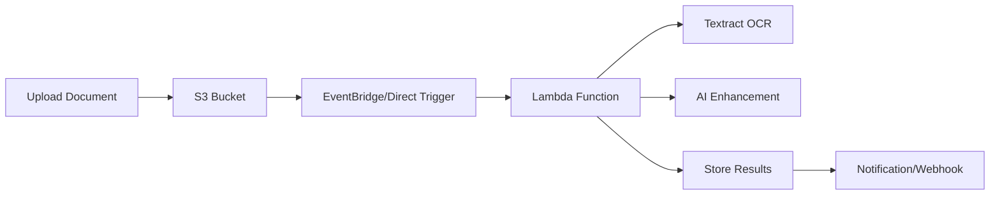
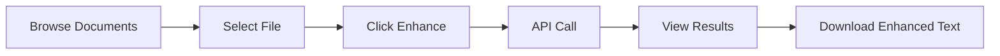

# 📄 OCR Text Enhancement Tool

A powerful Streamlit web application that enhances OCR-extracted text from documents stored in AWS S3. This tool uses AWS Textract for OCR and AI-powered text enhancement to fix spelling mistakes, correct OCR errors, and improve text readability.

## 🔔 **Important:In future we need to implemet Automatic Processing Setup**

> **⚡ For automatic document processing when files are uploaded to S3, you need to configure S3 Event Notifications with AWS EventBridge or direct Lambda triggers. This enables real-time processing without manual intervention.**
>

> - **Future Architecture:** S3 → EventBridge → Lambda (recommended for complex workflows)

>
> See the [AWS Integration Setup](#aws-integration-setup) section below for detailed configuration instructions.


## 🔄 Processing Workflows

### Automatic Processing (S3 + EventBridge/Lambda) Future only will implemet soon



**Benefits:**
- ✅ Real-time processing
- ✅ No manual intervention required
- ✅ Scalable for high volumes
- ✅ Cost-effective for batch processing

### Manual Processing (Streamlit Interface) Current 



**Benefits:**
- ✅ Interactive review and validation
- ✅ Quality control and testing
- ✅ Selective processing
- ✅ User-friendly interface

## 🚀 Quick Start

### Prerequisites

- Python 3.8 or higher
- AWS account with configured credentials
- S3 bucket with documents
- Lambda function for text enhancement (API endpoint)

### Installation

1. **Clone or download the project:**
```bash
mkdir ocr-enhancement-tool
cd ocr-enhancement-tool
```

2. **Create the required files:**
   - Save the application code as `app.py`
   - Save the dependencies as `requirements.txt`

3. **Install dependencies:**
```bash
pip install -r requirements.txt
```

4. **Configure AWS credentials:**

Choose one of the following methods:

**Option A: AWS CLI**
```bash
aws configure
```

**Option B: Environment Variables**
```bash
export AWS_ACCESS_KEY_ID=your_access_key_id
export AWS_SECRET_ACCESS_KEY=your_secret_access_key
export AWS_DEFAULT_REGION=us-east-1
```

**Option C: IAM Role (for EC2 instances)**
- Attach an IAM role with S3 permissions to your EC2 instance

### Configuration

Edit the configuration variables in `app.py`:

```python
# Configuration
S3_BUCKET = "your-s3-bucket-name"           # Your S3 bucket
S3_FOLDER = "pytextract"                    # Folder containing documents
LAMBDA_API_URL = "your-lambda-api-endpoint" # Your enhancement API endpoint
```

### Run the Application

```bash
streamlit run app.py
```

The application will open in your browser at `http://localhost:8501`

## 🔧 AWS Integration Setup


###  S3 → Lambda Direct Trigger

**Configure S3 Event Notification:**
```bash
aws s3api put-bucket-notification-configuration \
  --bucket your-bucket-name \
  --notification-configuration '{
    "LambdaConfigurations": [{
      "Id": "ocr-trigger",
      "LambdaFunctionArn": "arn:aws:lambda:region:account:function:your-function-name",
      "Events": ["s3:ObjectCreated:*"],
      "Filter": {
        "Key": {
          "FilterRules": [{
            "Name": "prefix",
            "Value": "pytextract/"
          }]
        }
      }
    }]
  }'
```

**Add Lambda Permission:**
```bash
aws lambda add-permission \
  --function-name your-function-name \
  --principal s3.amazonaws.com \
  --action lambda:InvokeFunction \
  --source-arn arn:aws:s3:::your-bucket-name \
  --statement-id s3-trigger-permission
```


## 🔧 AWS Setup

### Required AWS Services

1. **S3 Bucket**: Store your documents
2. **AWS Textract**: OCR processing
3. **AWS Lambda**: Text enhancement API
4. **AWS Bedrock**: AI model for text enhancement

### IAM Permissions

**For Streamlit App (S3 Access):**
```json
{
    "Version": "2012-10-17",
    "Statement": [
        {
            "Effect": "Allow",
            "Action": [
                "s3:ListBucket",
                "s3:GetObject"
            ],
            "Resource": [
                "arn:aws:s3:::your-bucket-name",
                "arn:aws:s3:::your-bucket-name/*"
            ]
        }
    ]
}
```

**For Lambda Function (Full Processing):**
```json
{
    "Version": "2012-10-17",
    "Statement": [
        {
            "Effect": "Allow",
            "Action": [
                "s3:GetObject",
                "textract:DetectDocumentText",
                "bedrock:InvokeModel",
                "logs:CreateLogGroup",
                "logs:CreateLogStream",
                "logs:PutLogEvents"
            ],
            "Resource": "*"
        }
    ]
}
```


```


### S3 Bucket Structure

```
your-s3-bucket/
└── pytextract/
    ├── document1.pdf
    ├── handwritten-note.jpg
    ├── scan.png
    └── ...
```

## 🖥️ User Interface

### Sidebar - Document Browser
- **File List**: All documents in your S3 folder
- **File Details**: Name, size, modification date
- **Refresh Button**: Update file list
- **Enhance Button**: Process selected document

### Main Area - Split View
**Left Panel - Original Document**
- PDF preview (first page)
- Image display for JPG/PNG files
- High-quality rendering

**Right Panel - Enhanced Text**
- AI-enhanced text output
- Formatted for readability
- Download button for saving

### Bottom Section - Analysis
**Left Panel - Changes Made**
- Detailed list of corrections
- Original vs corrected text
- Color-coded change types:
  - 🟢 Spelling corrections
  - 🟡 OCR error fixes
  - 🔵 Formatting improvements

**Right Panel - Summary**
- Overall enhancement summary
- Original OCR text (expandable)
- Processing statistics
### Dependencies

- **streamlit**: Web application framework
- **boto3**: AWS SDK for Python
- **requests**: HTTP library for API calls
- **Pillow**: Image processing
- **PyMuPDF**: PDF handling and rendering

### File Support

| Format | Preview | OCR Support | Notes |
|--------|---------|-------------|-------|
| PDF | ✅ First page | ✅ | Up to 10MB |
| JPG | ✅ Full image | ✅ | Recommended |
| PNG | ✅ Full image | ✅ | Recommended |
| JPEG | ✅ Full image | ✅ | Recommended |

### API Integration

The application integrates with a Lambda function that:
1. Receives S3 file location
2. Processes document with AWS Textract
3. Enhances text using AI (AWS Bedrock)
4. Returns structured results

**API Request:**
```json
{
    "bucket": "your-bucket-name",
    "key": "pytextract/document.pdf"
}
```

**API Response:**
```json
{
    "original_text": "Original OCR text...",
    "enhanced_text": "Enhanced and corrected text...",
    "changes_made": [
        {
            "original": "teh",
            "corrected": "the",
            "type": "spelling"
        }
    ],
    "summary": "Fixed 3 spelling errors and 2 OCR mistakes"
}
```


### Debug Mode

Enable debug information by adding to the sidebar:

```python
if st.checkbox("Debug Mode"):
    st.write("Session State:", st.session_state)
    st.write("Selected File:", st.session_state.selected_file)
```

## 📁 Project Structure

```
ocr-enhancement-tool/
├── app.py                 # Main Streamlit application
├── requirements.txt       # Python dependencies
├── README.md             # This documentation
└── .gitignore            # Git ignore file (optional)
```


For issues and questions:
1. Check the troubleshooting section above
2. Review AWS service limits and quotas
3. Verify all configuration settings
4. Test with a simple document first